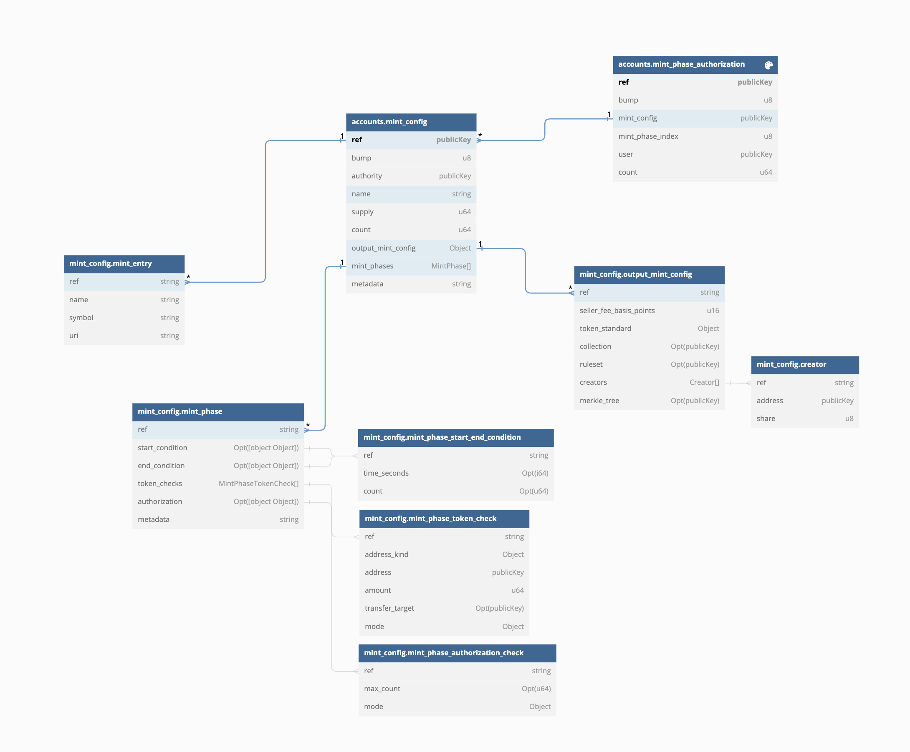

# Mint Generator

### A program for random token minting on solana.

Includes the following features

- Randomness
- On-chain minting phases
- Multiple phases based on time, or count of tokens minted
- Optional payment per phase in one or more SPL tokens or SOL (multi-token payment supported)
- Optional token burns to mint (multi-token supported)
- Optional token check to confirm holder of specific tokens can mint
- Allowlist / denylist
- Compressed NFTs
- Programmable NFTs

Also included is a CLI to operate the program which includes

- Uploading metadata in batch to shadowdrive
- Creating, modifying existing mint configs

The program also has a corresponding [web UI](https://github.com/solana-reference/solana-mint-generator-ui)

## Packages

| Type           | Directory               | Description                                                                                    | Version |
| :------------- | :---------------------- | :--------------------------------------------------------------------------------------------- | ------- |
| Solana Program | [/programs](/programs/) | Program for creating new mints and phases, uploading mint metadata and minting tokens randomly | 0.1.0   |
| Typescript SDK | [/sdk](/sdk)            | TypeScript SDK for interacting with the mint-generator Solana program                          | 0.1.0   |
| CLI            | [/cli](/cli)            | CLI for interacting with the mint-generator Solana program                                     | 0.1.0   |

<br/><br/>

# Using the [UI](https://github.com/solana-reference/solana-mint-generator-ui)

The corresponding UI for this program can be found here (https://github.com/solana-reference/solana-mint-generator-ui). The UI can data from any mint config and provide the ability for users to interact with the mint config. The mint config and individual phases both store their own metadata in JSON format on chain.

View the UI repo for more details on the format for this metadata.

# Solana Program

The Program is deployed on Solana on devnet and mainnet-beta

- Mint Generator: [`mintjBhypUqvbKvCePPsQN55AYBY3DwFWpuR5PDURdH`](https://explorer.solana.com/address/mintjBhypUqvbKvCePPsQN55AYBY3DwFWpuR5PDURdH)
<br/><br/>
<div style="text-align: center; width: 100%;">
  
</div>
<div style="text-align: center; font-style:italic; font-size: 12px; margin: 0px auto">This diagram can be generated using `yarn erd:generate` and viewed by pasting `DIAGRAM.txt` into https://dbdiagram.io/d/</div>

## MintConfig (Account)

The `MintConfig` PDA stores all the information associated with the mint. There is not other data being stored in any externsal resources to facilitate the mint (eg. off-chain db).

```rs
seeds = [MINT_CONFIG_PREFIX.as_bytes(), ix.name.as_bytes()],
```

```rs
pub struct MintConfig {
    // bump seed for the `mint_config` PDA instance
    pub bump: u8,
    // public key that owns the `mint_config` instance - only authority can make changes to the mint_config
    pub authority: Pubkey,
    // name of the mint_config also used as a PDA derivation seed
    pub name: String,
    // total initial supply of the mint - increments as new mint_entries are added
    pub supply: u64,
    // count of tokens that have been minted from this mint config
    pub count: u64,
    // configuration about the output tokens being minted
    pub output_mint_config: OutputMintConfig,
    // different phases that can be minted from for this mint config
    pub mint_phases: Vec<MintPhase>,
    // JSON formatted metadata string
    pub metadata: String,
}
```

### `output_mint_config`

Stores information about the output tokens being minted. Also allows for additional configuration for pNFTs and cNFTs

---

**NOTE:** pNFTs and cNFTs are both supported but cannot be used together! Learn more about <a href="">pNFTs</a> and <a href="">cNFTs</a>

---

- Example 1: Minting a pNFT you must choose `TokenStandard::ProgrammableNonFungible` and also specify a ruleset
- Example 2: Mint a cNFT (compressed NFT) you must choose a valid `merkle_tree`. When set this will indicate to also compress the NFT upon minting

```rs
pub struct OutputMintConfig {
    // royalty amount of the output tokens
    pub seller_fee_basis_points: u16,
    // token standard for the output tokens (for pNFTs choose ProgrammableNonFungible)
    pub token_standard: TokenStandard,
    // address to set for the output tokens collection according to Metaplex Collection Standard
    pub collection: Option<Pubkey>,
    // ruleset address to set for the tokens (NOTE: only relevent when using TokenStandard::ProgrammableNonFungible)
    pub ruleset: Option<Pubkey>,
    // creators to set on the output token
    pub creators: Vec<Creator>,
    //  merkle tree address to mint output tokens into (must be a valid merkle tree) - (NOTE: output token will be compressed when `merkle_tree` address is set)
    pub merkle_tree: Option<Pubkey>,
}

pub enum TokenStandard {
    NonFungible,             // MPLTokenStandard::NonFungible,
    FungibleAsset,           // MPLTokenStandard::FungibleAsset
    Fungible,                // MPLTokenStandard::Fungible
    NonFungibleEdition,      // MPLTokenStandard::NonFungibleEdition
    ProgrammableNonFungible, // MPLTokenStandard::ProgrammableNonFungible
}

pub struct Creator {
    pub address: Pubkey, // creator address
    pub share: u8,       // royalty share
}
```

### `mint_phases`

List of mint phases that the mint will facilitate. Multiple phases can be active at one time and multiple token checks can be used on a single phase.

---

**NOTE:** To add a payment for the phase add a token check with mode transfer and a transfer_target! More than one payment can be added in the vector and ue PublicKey::Default for native sol payment and remember `amount` is specified in the natural amount and must account for the mint decimals!

Use `PublicKey::Default (11111111111111111111111111111111)` for native sol payment and remember `amount` is specified in the natural amount and must account for the mint decimals!

---

Examples of start and end conditions

- Example 1: Activate phase once X total tokens have been minted and deactivate it after Y total tokens have been minted.
- Example 2: Activate phase at timestamp X and deactivate it at timestamp Y.
- Example 3: Activate phase at timestamp X and deactivate it once Y total tokens have been minted.
- Example 4: Activate phase once X total tokens have been minted and deactivate it at timestamp Y.

Examples of token checks

- Example 1: Transfer 1 SOL to pay for the mint to the specified transfer target
- Example 2: Pay in USDC to the specified transfer target for the mint
- Example 3: Check if the minting users holds a token from a given collection to mint
- Example 4: Burn a token in the given collection to mint a new token

```rs
pub struct MintPhase {
    // if set - condition must be valid to mint from this phase
    pub start_condition: Option<MintPhaseStartEndCondition>,
    // if set - condition must be invalid to mint from this phase
    pub end_condition: Option<MintPhaseStartEndCondition>,
    // token checks to validate when minting
    pub token_checks: Vec<MintPhaseTokenCheck>,
    // authorization check to valid via authorization record PDA when minting
    pub authorization: Option<MintPhaseAuthorizationCheck>,
    // JSON formatted metadata string
    pub metadata: String,
}

// conditions that dictate when a mint phase is active base on time or minted tokens count
pub struct MintPhaseStartEndCondition {
    // start or end timestamp in seconds
    pub time_seconds: Option<i64>,
    // start or end count
    pub count: Option<u64>,
}

pub struct MintPhaseTokenCheck {
    // address kind for this token check
    pub address_kind: MintPhaseTokenCheckAddressKind,
    // address for this token check (Pubkey::default() for native SOL)
    pub address: Pubkey,
    // amount of tokens to use for this token check
    pub amount: u64,
    // transfer target if mode is transfer
    pub transfer_target: Option<Pubkey>,
    // mode for this token check
    pub mode: MintPhaseTokenCheckMode,
}

pub enum MintPhaseTokenCheckAddressKind {
    Mint = 0,       // the address is a mint address
    Collection = 1, // the address is a collection address
    Creator = 2,    // the address is a creator address
}

pub enum MintPhaseTokenCheckMode {
    Check = 0,    // check that the tokens are owned
    Transfer = 1, // transfer the specified tokens
    Burn = 2,     // burn the specified tokens
}
```

## Program Instructions

The entrypoint for all program instructions can be found in `lib.rs` file in the program directory. Every instruction is relevent to modifying state in the program.

```rs
    pub fn init_mint_config(ctx: Context<InitMintConfigCtx>, ix: InitMintConfigIx) -> Result<()> {
        init_mint_config::handler(ctx, ix)
    }

    pub fn update_mint_config(ctx: Context<UpdateMintConfigCtx>, ix: UpdateMintConfigIx) -> Result<()> {
        update_mint_config::handler(ctx, ix)
    }

    pub fn set_mint_config_metadata(ctx: Context<SetMintConfigMetadataCtx>, ix: SetMintConfigMetadataIx) -> Result<()> {
        set_mint_config_metadata::handler(ctx, ix)
    }

    pub fn close_mint_config(ctx: Context<CloseMintConfigCtx>) -> Result<()> {
        close_mint_config::handler(ctx)
    }

    pub fn set_mint_phase_authorization(ctx: Context<SetMintPhaseAuthorizationCtx>, ix: SetMintPhaseAuthorizationIx) -> Result<()> {
        set_mint_phase_authorization::handler(ctx, ix)
    }

    pub fn close_mint_phase_authorization(ctx: Context<CloseMintPhaseAuthorizationCtx>) -> Result<()> {
        close_mint_phase_authorization::handler(ctx)
    }

    pub fn set_mint_entry(ctx: Context<SetMintEntryCtx>, ix: SetMintEntryIx) -> Result<()> {
        set_mint_entry::handler(ctx, ix)
    }

    pub fn mint<'key, 'accounts, 'remaining, 'info>(ctx: Context<'key, 'accounts, 'remaining, 'info, MintCtx<'info>>, ix: MintIx) -> Result<()> {
        mint::handler(ctx, ix)
    }
```

<br/>
<br/>

# Typescript SDK

There is an associated typescript SDK for using this program from within a browser or javascript/typescript environment. The SDK is a thin wrapper around the `@coral-xyz/anchor` generated code. To access all anchor generated methods

## Create a new mint

```ts
import { executeTransaction } from "@cardinal/common";
import { utils, Wallet } from "@coral-xyz/anchor";
import {
  Connection,
  Keypair,
  LAMPORTS_PER_SOL,
  PublicKey,
  SystemProgram,
  Transaction,
} from "@solana/web3.js";
import { BN } from "bn.js";

import {
  fetchIdlAccount,
  findMintConfigId,
  mintGeneratorProgram,
} from "../../sdk";

////////
const connection = new Connection("https://api.devnet.solana.com");
const wallet = new Wallet(
  Keypair.fromSecretKey(utils.bytes.bs58.decode("MY-KEYPAIR"))
);
const paymentRecipientKeypair = Keypair.generate();
const configName = "MY-TEST-CONFIG";
////////

const tx = new Transaction();
tx.add(
  await mintGeneratorProgram(connection, wallet)
    .methods.initMintConfig({
      authority: wallet.publicKey,
      name: configName,
      outputMintConfig: {
        sellerFeeBasisPoints: 10,
        tokenStandard: { nonFungible: undefined },
        collection: null,
        ruleset: null,
        creators: [],
        merkleTree: null,
      },
      mintPhases: [
        {
          metadata: JSON.stringify({
            title: "Phase I",
            subtitle: "Phase I Test",
          }),
          startCondition: null,
          endCondition: null,
          tokenChecks: [
            {
              addressKind: { mint: undefined },
              address: PublicKey.default,
              amount: new BN(LAMPORTS_PER_SOL / 10),
              transferTarget: paymentRecipientKeypair.publicKey,
              mode: { transfer: undefined },
            },
          ],
          authorization: null,
        },
      ],
      metadata: "",
    })
    .accountsStrict({
      mintConfig: findMintConfigId(configName),
      authority: wallet.publicKey,
      payer: wallet.publicKey,
      systemProgram: SystemProgram.programId,
    })
    .instruction()
);
await executeTransaction(connection, tx, wallet);
const mintConfig = await fetchIdlAccount(
  connection,
  findMintConfigId(configName),
  "mintConfig"
);
console.log(mintConfig);
```

## Mint a token

```ts
import { executeTransaction } from "@cardinal/common";
import { utils, Wallet } from "@coral-xyz/anchor";
import { Connection, Keypair } from "@solana/web3.js";

import { findMintConfigId, mint } from "../../sdk";

////////
const connection = new Connection("https://api.devnet.solana.com");
const wallet = new Wallet(
  Keypair.fromSecretKey(utils.bytes.bs58.decode("MY-KEYPAIR"))
);
const configName = "MY-TEST-CONFIG";
////////

const [tx, outputMintKeypair] = await mint(
  connection,
  wallet,
  findMintConfigId(configName),
  0
);
if (!outputMintKeypair) throw "No output mint keypair";
await executeTransaction(connection, tx, wallet, {
  signers: [outputMintKeypair],
});
```

## More examples

See the tests for in the `/tests` for more example usages of the SDK.

<br/>
<br/>

# CLI

Inside the program is also a CLI to interact with various instructions and functions related to the program. The CLI is a single cli.ts file that can be run with a specified command.

## Getting started

```bash
git clone https://github.com/solana-reference/solana-mint-generator
yarn
ts-node cli/cli.ts --help
```

## Configuration

Every command in the CLI will have 2 command line arguments - one for specifying the wallet and another for specifying the target Solana cluster. The wallet can be overridden with environment variable (saved in a file called .env in the current working directory of the repo) WALLET="". The private key, encoded as either a string or array of bytes, must be saved in that environment variable.

All other arguments are specified in the target function file. When calling a command it will print the arguments used before executing, indicating to the user where they can go and modify the arguments. The reason for this is simply to avoid custom argument parsing, but a future feature addition may generate the arguments to the CLI as well.

## Commands

```bash
cli.ts <command>

Commands:
  cli.ts initMintConfig             Initialize a mint config
  cli.ts updateMintConfig           Update a mint config
  cli.ts setMintConfigMetadata      Set metedata for a mint config
  cli.ts closeMintConfig            Close a mint config
  cli.ts getMintConfig              Get a mint config
  cli.ts getMintConfigsByAuthority  Get all mint configs by authority
  cli.ts setMintEntries             Set mint config entries
  cli.ts uploadShadowDrive          Upload to shadow drive
  cli.ts mint                       Mint a token from a mint config
  cli.ts createMerkleTree           Create merkle tree for compressed nfts
  cli.ts delegateMerkleTreeForMint  Delegate a merkle tree for minting

Positionals:
  wallet   Wallet to use - default to WALLET environment variable
                                                 [default: "process.env.WALLET"]
  cluster  Solana cluster moniker to use [mainnet, devnet] - ovverride url with
           RPC_URL environment variable or mainnet moniker with MAINNET_PRIMARY
           environment variable                              [default: "devnet"]

Options:
      --version  Show version number                                   [boolean]
  -h, --help     Show help                                             [boolean]
```
